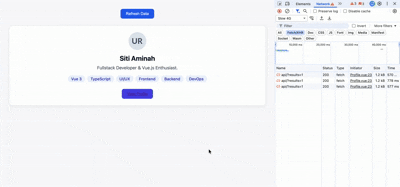

# ✨ Vue Auto Shimmer

[](https://www.npmjs.com/package/@ubay182/vue-auto-shimmer)
[](https://github.com/ubay1/vue-auto-shimmer/blob/main/LICENSE)
[](https://vuejs.org)
[](https://nuxt.com)

> 🚀 Auto-adapting shimmer loader untuk Vue 3 yang **otomatis menyesuaikan bentuk, ukuran, dan posisi** dengan UI asli Anda. Tidak ada lagi skeleton manual yang tidak presisi!



## ✨ Fitur

- 🎯 **Auto-Measurement**: Shimmer otomatis mengukur dimensi elemen asli (teks, gambar, button, dll)
- 🧠 **Smart Caching**: Dimensi disimpan per `cacheKey`, shimmer presis di load berikutnya
- 🎨 **Blueprint Skeleton**: Berikan template HTML di slot `#skeleton` untuk first-load yang akurat
- 📐 **Padding & Border Aware**: Mendukung padding, border, border-radius, dan box-shadow via props
- 🔄 **Resize Observer**: Auto-update saat konten berubah ukuran (responsive, flex-wrap, dll)
- 🌗 **Framework Agnostic**: Tidak tergantung Tailwind, Bootstrap, atau CSS framework apapun
- 🟢 **Nuxt Ready**: SSR-safe, bekerja langsung di Nuxt 3/4 dengan `<ClientOnly />` atau tanpa `<ClientOnly>`
- 📦 **Zero CSS Import**: Komponen sepenuhnya self-contained, tidak perlu import CSS terpisah
- 🛠️ **TypeScript Ready**: Full type definitions included

## 📦 Instalasi

```bash
# npm
npm install @ubay182/vue-auto-shimmer

# yarn
yarn add @ubay182/vue-auto-shimmer

# pnpm
pnpm add @ubay182/vue-auto-shimmer
```

<br />
<br />

## Basic Usage

```js
<script setup>
import { ref } from "vue";
import { Shimmer } from "@ubay182/vue-auto-shimmer";

const loading = ref(true);
const data = ref(null);
</script>

<template>
  <Shimmer :loading="loading" cache-key="my-card">
    <!-- Konten Asli -->
    <div class="card">
      <h2>{{ data?.title }}</h2>
      <p>{{ data?.description }}</p>
    </div>

    <!-- Blueprint Skeleton (untuk first load) -->
    <template #skeleton>
      <div class="card">
        <h2>Loading title...</h2>
        <p>Loading description...</p>
      </div>
    </template>
  </Shimmer>
</template>
```

## Usage with Nuxt 3/4 & Tailwind CSS

```ts
<script setup lang="ts">
import { ref, onMounted } from "vue";
import { Shimmer } from "@ubay182/vue-auto-shimmer";
// import Shimmer from "@/components/Shimmer2.vue";

const loading = ref(true);
const user = ref<any>(null);

const fetchData = () => {
  loading.value = true;
  // Simulasi data dinamis
  const names = ["Ubaidillah Rahman", "Budi Santoso", "Siti Aminah"];
  const randomName = names[Math.floor(Math.random() * names.length)];

  setTimeout(() => {
    user.value = {
      name: randomName,
      bio: "Fullstack Developer & Vue.js Enthusiast.",
      avatar: "https://placehold.co/100x100/e2e8f0/475569?text=UR",
      tags: ["Vue 3", "TypeScript", "UI/UX", "Frontend", "Backend", "DevOps"], // Added more tags to test wrap
    };
    loading.value = false;
  }, 5000);
};

onMounted(() => fetchData());
</script>

<ClientOnly>
    <Shimmer
      :loading="loading"
      cache-key="user-profile"
      border="1px solid #e5e7eb"
      border-radius="12px"
      box-shadow="0 4px 12px rgba(0,0,0,0.05)"
      bg-color="#ffffff"
      padding="1.5rem"
    >
      <!-- KONTEN ASLI -->
      <div class="flex flex-col items-center text-center w-full">
        
        <h2 class="text-2xl font-bold text-gray-900 mb-2 w-full">
          {{ user?.name || "Loading Name..." }}
        </h2>
        <p class="text-gray-600 leading-relaxed mb-4 w-full">
          {{ user?.bio || "Loading bio..." }}
        </p>

        <!-- Tags Container dengan Flex Wrap -->
        <div class="flex flex-wrap gap-2 mb-4 justify-center w-full">
          <span
            v-for="tag in user?.tags || []"
            :key="tag"
            class="bg-indigo-50 text-indigo-800 px-3 py-1 rounded-full text-sm font-medium whitespace-nowrap"
          >
            {{ tag }}
          </span>
        </div>

        <button class="px-5 py-2.5 border-none rounded-lg cursor-pointer font-medium text-sm bg-indigo-600 text-white mt-2">
          <RouterLink to="/profile" class="text-white">
            View Profile
          </RouterLink>
        </button>
      </div>

      <!-- SKELETON BLUEPRINT -->
      <template #skeleton>
        <div class="flex flex-col items-center text-center w-full">
          <div class="w-16 h-16 rounded-full bg-gray-200 mb-4"></div>
          <h2 class="w-3/5 h-6 bg-gray-200 rounded mb-2"></h2>
          <p class="w-full h-4 bg-gray-200 rounded mb-4"></p>
          <div class="flex flex-wrap gap-2 mb-4 justify-center w-full">
            <span class="inline-block w-15 h-6 bg-gray-200 rounded-full"></span>
            <span class="inline-block w-15 h-6 bg-gray-200 rounded-full"></span>
            <span class="inline-block w-15 h-6 bg-gray-200 rounded-full"></span>
            <span class="inline-block w-15 h-6 bg-gray-200 rounded-full"></span>
            <span class="inline-block w-15 h-6 bg-gray-200 rounded-full"></span>
            <span class="inline-block w-15 h-6 bg-gray-200 rounded-full"></span>
          </div>

          <button class="px-5 py-2.5 border-none rounded-lg cursor-pointer font-medium text-sm bg-indigo-600 text-white mt-2">
            View Profile
          </button>
        </div>
      </template>
    </Shimmer>

    <template #fallback>
      <div class="border border-gray-200 rounded-xl shadow-sm bg-white p-6">
        <div class="flex flex-col items-center text-center w-full">
          <div class="w-16 h-16 rounded-full bg-gray-200 mb-4"></div>
          <h2 class="w-3/5 h-6 bg-gray-200 rounded mb-2"></h2>
          <p class="w-full h-4 bg-gray-200 rounded mb-4"></p>
          <div class="flex flex-wrap gap-2 mb-4 justify-center w-full">
            <span class="inline-block w-15 h-6 bg-gray-200 rounded-full"></span>
            <span class="inline-block w-15 h-6 bg-gray-200 rounded-full"></span>
            <span class="inline-block w-15 h-6 bg-gray-200 rounded-full"></span>
            <span class="inline-block w-15 h-6 bg-gray-200 rounded-full"></span>
            <span class="inline-block w-15 h-6 bg-gray-200 rounded-full"></span>
            <span class="inline-block w-15 h-6 bg-gray-200 rounded-full"></span>
          </div>

          <div class="px-5 py-2.5 border-none rounded-lg font-medium text-sm bg-indigo-600 text-white mt-2">
            View Profile
          </div>
        </div>
      </div>
    </template>
  </ClientOnly>
```

## Global Registration (Opsional)

```js
// main.ts
import { createApp } from "vue";
import App from "./App.vue";
import VueAutoShimmer from "@ubay182/vue-auto-shimmer";

createApp(App)
  .use(VueAutoShimmer) // Register komponen <Shimmer> secara global
  .mount("#app");
```

## 📚 API Reference

| Prop         | Tipe    | Default                      | Deskripsi                                                                         |
| ------------ | ------- | ---------------------------- | --------------------------------------------------------------------------------- |
| loading      | boolean | false                        | Kontrol state loading (true = tampilkan shimmer)                                  |
| cacheKey     | string  | -                            | Unique key untuk caching dimensi. Wajib agar shimmer presis di refresh berikutnya |
| border       | string  | '1px solid #e5e7eb'          | CSS border untuk wrapper container                                                |
| borderRadius | string  | '8px'                        | CSS border-radius untuk wrapper                                                   |
| boxShadow    | string  | '0 2px 8px rgba(0,0,0,0.05)' | CSS box-shadow untuk wrapper                                                      |
| bgColor      | string  | '#ffffff'                    | Background color wrapper                                                          |
| padding      | string  | '1.5rem'                     | Padding internal wrapper (shimmer blocks diukur relatif terhadap area ini)        |

## Slot

| Slot     | Deskripsi                                                                                                      |
| -------- | -------------------------------------------------------------------------------------------------------------- |
| default  | Konten asli yang akan ditampilkan saat loading=false                                                           |
| skeleton | Blueprint HTML untuk first-load shimmer. Strukturnya sebaiknya mirip dengan konten asli agar pengukuran akurat |

## Events

(Belum ada events custom, tapi komponen mendukung semua event Vue native via $attrs)

## 🎨 Advanced Usage (Dynamic Content + API Fetch)

```js
<script setup>
import { ref, onMounted } from 'vue'
import { Shimmer } from '@ubay182/vue-auto-shimmer'

const loading = ref(true)
const user = ref(null)

const fetchUser = async (id) => {
  loading.value = true
  try {
    const res = await fetch(`https://api.example.com/users/${id}`)
    user.value = await res.json()
  } finally {
    loading.value = false
  }
}

onMounted(() => fetchUser(123))
</script>

<template>
  <Shimmer :loading="loading" cache-key="user-profile">
    <div class="profile">
      
      <h1>{{ user?.name }}</h1>
      <p>{{ user?.bio }}</p>
    </div>

    <template #skeleton>
      <div class="profile">
        <div class="avatar-placeholder" />
        <h1 class="name-placeholder" />
        <p class="bio-placeholder" />
      </div>
    </template>
  </Shimmer>
</template>
```

## Skip Elements

Gunakan data-shimmer-ignore untuk mengecualikan elemen tertentu dari shimmer:

```html
<div>
  <h2>Title</h2>
  <p data-shimmer-ignore>Ini tidak akan jadi shimmer</p>
  <button>Action</button>
</div>
```

## Skip Entire Section

```html
<div data-shimmer-skip>
  <!-- Konten ini tidak akan di-scan untuk shimmer -->
  <StaticBanner />
</div>
```

## 🛠️ Development

```bash
# Clone repo
git clone https://github.com/ubay1/vue-auto-shimmer.git
cd vue-auto-shimmer

# Install dependencies
npm install

# Run playground (dev mode)
npm run dev

# Build library
npm run build

# Preview build output
npm run preview
```

## 🤝 Contributing

Contributions welcome!

Silakan:

1. Fork repo
2. Buat branch fitur (git checkout -b feat/amazing-feature)
3. Commit perubahan (git commit -m 'Add amazing feature')
4. Push ke branch (git push origin feat/amazing-feature)
5. Buka Pull Request

Pastikan:

1. ✅ Code mengikuti style yang ada
2. ✅ Tidak ada error TypeScript
3. ✅ Playground masih berjalan normal
4. ✅ Update README jika menambah fitur baru

## 📄 License

MIT License - see LICENSE file for details.
